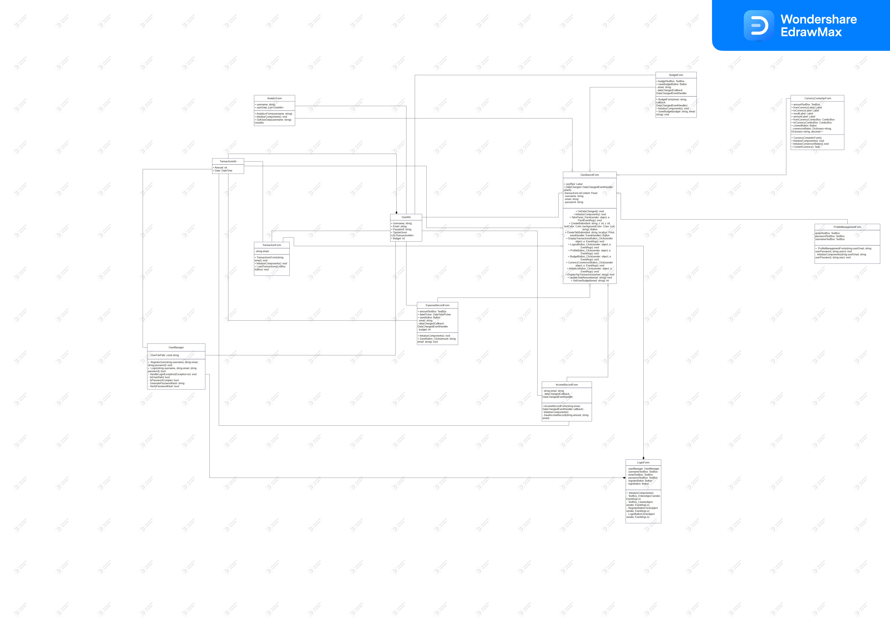

# BigBag---Personal-Financial-Management-Desktop-App
A comprehensive desktop application for managing personal finances, featuring expense tracking, income management, budgeting tools, currency conversion, and secure data handling. Built in C# with robust analytics and reporting features.

BigBag is a powerful desktop application designed to streamline personal financial management. It enables users to easily track their expenses, manage income, set budgets, and gain insights into their spending patterns with detailed analytics and reports. Built using C# and developed with a user-friendly interface, BigBag helps users maintain financial control with essential features like data security, currency conversion, and even integrated mini-games for a refreshing break.

THERE ARE THREE MAIN FOLDERS : 

**itteration01** : Not included all features but in working form

**itteration02**   Some more features added 

**Final_Iteration**. Final Website with all features mentioned in **[FINAL_REPORT.pdf](./FINAL_REPORT.pdf)**

## Table of Contents
- [Features](#features)
- [Installation](#installation)
- [Usage](#usage)
- [Architecture](#architecture)
- [Screenshots](#screenshots)
- [Contributing](#contributing)
- [License](#license)

## Features
BigBag provides the following key functionalities:
- **Expense Recording**: Easily input expenses with details like amount, date, currency, and category.
- **Income Tracking**: Manage various income sources and monitor overall financial status.
- **Budget Management**: Set and track monthly or yearly budgets, with visual indicators for spending limits.
- **Expense Analytics**: Generate reports and visual charts to analyze spending habits.
- **Currency Conversion**: Convert transactions across multiple currencies with real-time exchange rates.
- **Data Security**: Strong encryption for user data, ensuring privacy and secure login features.
- **Mini-Games**: Relax with integrated games within the app for a unique user experience.

## Installation

1. Clone the repository:
    ```bash
    git clone https://github.com/yourusername/BigBag.git
    ```
2. Open the project in Visual Studio:
    - Open `BigBag.sln` to load the project solution.
3. Build the project:
    - In Visual Studio, click on **Build > Build Solution** to compile the application.
4. Run the application:
    - Press **F5** or navigate to **Debug > Start Debugging** to launch BigBag.

## Usage

Once the application is running:
1. **Sign Up/Log In**: Register a new account or log in securely to access your dashboard.
2. **Track Expenses and Income**: Input your expenses and income under respective sections.
3. **Set Budgets**: Navigate to the budget management section to define spending limits on different categories.
4. **View Analytics**: Use the analytics dashboard to review detailed expense reports, including visual graphs.
5. **Play Games**: Take a break with mini-games integrated within the dashboard.

## Architecture

BigBag follows a modular design, separating the app into key components:
- **User Management**: Handles registration, login, and profile management.
- **Expense & Income Management**: Provides functionality for recording transactions.
- **Budgeting & Analytics**: Offers reporting tools and budget management features.
- **Data Security**: Implements encryption and secure data handling.
- **Mini-Games**: Includes built-in games for user engagement.

### Diagrams

1. **Class Diagram**:  
   
   
2. **Use Case Diagram**:  
   
   
3. **Activity Diagram**:  
   

4. **Sequence Diagram**:  
   
   
5. **Architecture Diagram**:  
   

## Screenshots

- **Dashboard**:  
   

- **Expense Management**:  
   

- **Analytics**:  
   

## Contributing

If you'd like to contribute to this project:
1. Fork the repository.
2. Create a new branch (`git checkout -b feature-branch`).
3. Make your changes.
4. Commit your changes (`git commit -m 'Add some feature'`).
5. Push to the branch (`git push origin feature-branch`).
6. Open a pull request.

